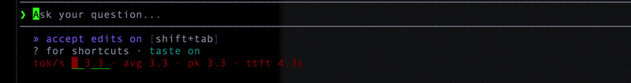

# commandcode-token-metrics

A live tokens-per-second meter for [Command Code](https://commandcode.ai), drawn in the footer under the input panel.



## Install

```bash
cmd mods add /path/to/commandcode-token-metrics -g
```

Then start a new session, or run `/reload`. There is no build step; Command Code compiles the mod at load time.

## What you get

While the model streams, one line in the footer shows a VU-style graph of generation speed, one column per second, coloured red, yellow or green against `slowTps` and `fastTps`:

```
tok/s ▃▆▇▇█▆▄█▆ 43.0 ▲2% · avg 41.0 · pk 45.0 · ttft 0.8s
```

`/tps` prints the last run's numbers, and a one-line summary lands in the feed when a run finishes.

## Options

Flags are set at launch with `--mod-option name=value`, repeatable. An unparseable value falls back to its default rather than throwing.

```bash
cmd --mod-option vuColumns=20 --mod-option slowTps=15
```

| Option | Default | What it does |
| --- | --- | --- |
| `enabled` | `true` | Render the meter at all |
| `rollingWindowMs` | `5000` | Averaging window for the live rate |
| `idleTimeoutMs` | `1500` | Silence after which the rate reads as inactive |
| `minSpanMs` | `300` | Floor on the elapsed span so early samples don't spike |
| `vuColumns` | `12` | Most seconds of history shown in the graph |
| `vuScale` | `auto` | `auto` scales to the run peak, `fixed` uses `vuFullTps` |
| `vuFullTps` | `50` | Full-scale tokens/sec when `vuScale` is `fixed` |
| `slowTps` | `10` | Below this is red |
| `fastTps` | `30` | At or above this is green |
| `showVu` | `true` | Show the graph |
| `showTrend` | `true` | Show the trend arrow |
| `showAvg` | `true` | Show the run average |
| `showPeak` | `true` | Show the peak |
| `showTtft` | `true` | Show time to first token |
| `showTokenCount` | `false` | Show the token counter, footer only |
| `showElapsed` | `false` | Show elapsed time, footer only |
| `alwaysShow` | `false` | Keep the meter visible when idle |
| `idleText` | `idle` | What `alwaysShow` reads when there is no data |
| `label` | `tok/s` | Leading label |
| `feedSummary` | `true` | Print a one-line summary when a run ends |
| `statusLog` | *(unset)* | Debug: append every painted status line to this file |

## Also for OpenCode

The same meter exists for the OpenCode TUI: [`opencode-token-metrics`](https://www.npmjs.com/package/opencode-token-metrics).

## Development

```bash
npm test        # unit tests
npm run typecheck
npm run smoke   # packs the tarball and drives the mod against a fake host
npm run ci      # all of the above, plus npm pack --dry-run
```

Notes for coding agents are in [AGENTS.md](./AGENTS.md).

## Built with Command Code

One Command Code CLI session, 82 turns, $0.18 in tokens.

## License

MIT
